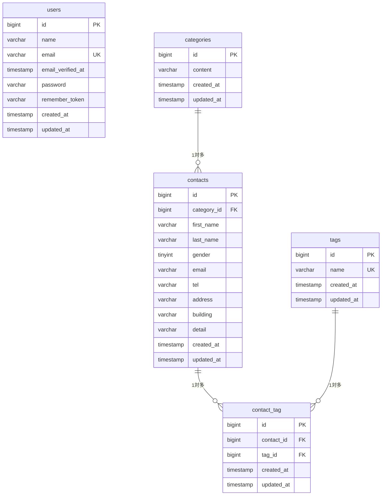

# COACHTECH お問い合わせフォーム

## 概要
教材で学んだバックエンド技術（Laravel, データベース設計, テスト）の実践として開発した、一般ユーザー向けの公開お問い合わせフォームおよび管理者向けの管理システムです。

### 実装機能（基本要件）
- **一般ユーザー向け機能**
  - お問い合わせフォーム入力ページ（バリデーション機能・エラーメッセージ日本語化）
  - 複数選択可能なタグ付与機能（多対多のテーブル連動）
  - 入力内容確認ページ（確認画面遷移時のデータ保持、苗字・名前の適切な並び順表示）
  - フォーム修正時の入力データ保持（電話番号各マスのデータ消失防止対応）
  - サンクスページ（送信完了画面およびHOMEリンク）
- **管理者向け機能**
  - 管理者登録画面（Fortifyによるバリデーションおよびアカウント作成）
  - ログイン画面（レート制限：5回/分、未認証ユーザーのアクセス制限）
  - 管理画面一覧（お問い合わせ内容の7件ごとページネーション表示、最新順での描画）
  - 複合検索機能（名前の部分一致、メールアドレス、性別、カテゴリ、日付での絞り込み、リセット機能）
  - お問い合わせ詳細ページ（カテゴリ情報・タグ情報を正しい文字列形式で詳細表示）
  - お問い合わせデータの削除機能（関連レコードの自動削除・管理画面へのリダイレクト）

## 使用技術
- PHP : 8.2
- Laravel : 10.x
- DB : MySQL 8.0
- Webサーバー : Nginx
- フロントエンド : Vite, Tailwind CSS, Alpine.js
- 開発ツール : Docker, Laravel Sail, phpMyAdmin

## 開発環境URL
- 開発環境トップ（お問い合わせ画面）: http://localhost
- 管理画面ログインページ: http://localhost/login
- phpMyAdmin: http://localhost:8080

## ER図（データベース設計）


## 環境構築手順
1. リポジトリをクローンまたはローカル環境に展開します。
2. プロジェクトのルートディレクトリに移動します。
3. 以下のコマンドを実行して、Dockerコンテナ（Laravel Sail）をバックグラウンドで起動します。
   ```bash
   ./vendor/bin/sail up -d
   ```
4. アプリケーションキーを生成します。
   ```bash
   sail artisan key:generate
   ```
5. データベースのマイグレーションと初期日本語データの投入を行います。
   ```bash
   sail artisan migrate:fresh --seed
   ```
6. フロントエンドの依存関係をインストールし、Vite開発サーバーを起動します。
   ```bash
   sail npm install
   sail npm run dev
   ```

## 作成者
- 橋本
